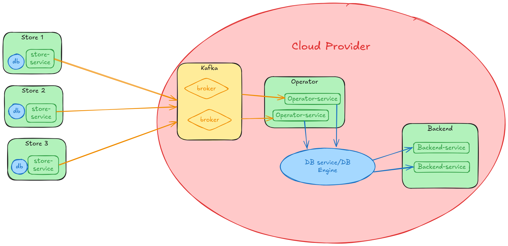

# Distributed Inventory Management System

## Considerations
The project was made over 95% by AI using agents to write the code, always guided by my knowledge, making it possible to write thousands of lines in the provided time and greatly increasing productivity.

### API Documentation (Swagger)
- **Backend Service**: http://localhost:8081/swagger/index.html
- **Store Service**: http://localhost:8080/swagger/index.html

## System Architecture

This system implements a distributed inventory management solution with event-driven architecture and hexagonal design. The system consists of multiple microservices that communicate through HTTP APIs and Apache Kafka.



*Figure 1: High-level system architecture showing service interactions and data flow*

### Services Overview

#### 1. DB Service (Port 8083)
- Simple HTTP API for global inventory persistence
- SQLite in-memory database
- RESTful endpoints for inventory CRUD operations
- Acts as the central data store for aggregated inventory

#### 2. Store Service (Port 8080)
- Local inventory management for individual stores
- In-memory SQLite database for fast local operations
- Fiber HTTP server with RESTful API
- Kafka producer for publishing inventory change events
- Hexagonal architecture with domain, application, and infrastructure layers

#### 3. Operator Service (Port 8082)
- Event processor that consumes inventory events from Kafka
- Maintains global inventory state by aggregating events and writing to DB Service
- **No public API routes** - operates as an event-driven worker service
- Health check endpoint only (`/health`)
- Depends on DB Service for persistence
- Kafka consumer with SASL authentication

#### 4. Backend Service (Port 8081)
- Public API gateway for inventory queries
- Queries data directly from DB Service
- Provides filtered and grouped inventory views
- RESTful API with Swagger documentation
- Depends on DB Service for data access

#### 5. Additional Services (cmd/)
- **aggregator**: Alternative aggregator implementation using internal shared components
- **localstore**: Alternative local store implementation using internal shared components

## Technical Stack

- **Language:** Go 1.25.1
- **Web Framework:** Fiber v2
- **Message Broker:** Apache Kafka with SASL PLAIN authentication
- **Database:** SQLite (in-memory instances)
- **Architecture:** Hexagonal Architecture (Ports & Adapters)
- **Testing:** Unit tests with table-driven tests
- **Documentation:** Swagger/OpenAPI for API documentation
- **Containerization:** Docker with multi-stage builds

## Project Structure

```
inventory-system/
├── backend-service/           # Public API service
│   ├── app/
│   │   ├── dto/              # Data Transfer Objects
│   │   └── service/          # Application services
│   ├── cmd/                  # Application entry point
│   ├── docs/                 # Generated API documentation
│   └── infra/
│       ├── db/               # Database repository
│       └── http/             # HTTP handlers
├── store-service/            # Local store service
│   ├── app/
│   │   ├── dto/              # Application DTOs
│   │   ├── port/             # Application ports
│   │   └── service/          # Application services
│   ├── cmd/
│   ├── docs/
│   ├── domain/               # Domain layer
│   │   ├── entity/           # Domain entities
│   │   ├── event/            # Domain events
│   │   └── valueobject/      # Value objects
│   └── infra/
│       ├── http/             # HTTP adapters
│       ├── kafka/            # Kafka adapters
│       └── sqlite/           # SQLite adapters
├── operator-service/         # Event processing service
│   ├── app/
│   ├── cmd/
│   ├── domain/
│   └── infra/
├── db-service/               # Simple data service
│   ├── cmd/
│   ├── domain/
│   └── infra/
├── cmd/                      # Additional command-line tools
│   ├── aggregator/           # Alternative aggregator
│   └── localstore/           # Alternative local store
├── internal/                 # Shared internal packages
│   └── inventory/            # Shared inventory components
└── docker-compose.yml        # Multi-service orchestration
```

## Event Flow

1. **Store Service** receives inventory updates via HTTP API
2. **Store Service** persists changes locally and publishes events to Kafka
3. **Operator Service** consumes events from Kafka topic
4. **Operator Service** processes events and updates global inventory state in **DB Service**
5. **Backend Service** queries aggregated inventory data directly from **DB Service**
6. **DB Service** provides persistent storage and query APIs for global inventory

## API Endpoints

### Store Service (Port 8080)
- `POST /api/v1/inventory` - Update stock levels
- `GET /api/v1/inventory/:storeId/:itemId` - Get specific item inventory
- `DELETE /api/v1/inventory/:storeId/:itemId` - Delete inventory item

### Operator Service (Port 8082)
- `GET /health` - Health check endpoint

### Backend Service (Port 8081)
- `GET /api/v1/inventory` - Get all inventories (with Swagger docs)
- `GET /api/v1/inventory/store/:storeId` - Get store-specific inventory
- `GET /api/v1/inventory/item/:itemId` - Get item-specific inventory
- `GET /api/v1/inventory/grouped` - Get grouped inventory by item

### DB Service (Port 8083)
- `GET /inventories` - Get all global inventories
- `POST /inventories` - Create/update inventory
- `GET /inventories/:storeId/:itemId` - Get specific inventory
- `DELETE /inventories/:storeId/:itemId` - Delete inventory

## Setup and Deployment

### Prerequisites
- Docker and Docker Compose
- Go 1.25.1+ (for local development)

### Quick Start

1. **Clone the repository:**
```bash
git clone https://github.com/LudSkywalker/inventory-system.git
cd inventory-system
```

2. **Start all services:**
```bash
docker-compose up --build
```

This will start:
- Kafka (message broker)
- DB Service (port 8083)
- Store Service (port 8080)
- Operator Service (port 8082)
- Backend Service (port 8081)

### Individual Service Startup

1. **Start Kafka first:**
```bash
docker-compose up kafka -d
```

2. **Start services in dependency order:**
```bash
docker-compose up db-service -d
docker-compose up store-service -d
docker-compose up operator-service -d
docker-compose up backend-service -d
```

### Environment Configuration

Each service can be configured via environment variables:

| Service | Variable | Default | Description |
|---------|----------|---------|-------------|
| All | `PORT` | Service-specific | HTTP server port |
| Store/Operator/Backend | `KAFKA_BROKERS` | `kafka:29092` | Kafka broker addresses |
| Store/Operator/Backend | `SASL_USER` | `admin` | Kafka SASL username |
| Store/Operator/Backend | `SASL_PASSWORD` | `admin-secret` | Kafka SASL password |
| Operator/Backend | `DB_URL` | `http://db-service:8083` | DB Service URL |

### Development Setup

1. **Install dependencies:**
```bash
go mod download
```

2. **Run tests:**
```bash
go test ./...
```

3. **Run specific service:**
```bash
cd store-service
go run cmd/main.go
```

## Testing

### Unit Tests
```bash
go test ./...
```

### End-to-End Tests
Run the provided E2E test scripts:
```bash
./e2e_store.sh     # Test store service inventory operations
./e2e_operator.sh  # Test operator service health check
./e2e_backend.sh   # Test backend service queries
./e2e_db.sh        # Test DB service persistence
```

### Manual Testing
```bash
# Update inventory in store
curl -X POST http://localhost:8080/api/v1/inventory \
  -H "Content-Type: application/json" \
  -d '{"item_id":"item1","store_id":"store1","quantity":100}'

# Query inventory via backend
curl http://localhost:8081/api/v1/inventory
```

## Architecture Details

### Hexagonal Architecture
Each service follows hexagonal architecture principles:

- **Domain Layer**: Core business logic and entities
- **Application Layer**: Use cases and DTOs
- **Infrastructure Layer**: External adapters (HTTP, Kafka, Database)

### Event-Driven Communication
- Store services publish inventory events to Kafka
- Operator service consumes and processes events
- Global state maintained through event sourcing

### Data Flow
```
Store Service → Kafka → Operator Service → DB Service
                                      ↓
                           Backend Service ← DB Service
```

## Monitoring & Observability

- **Health Checks**: Each service provides `/health` endpoints
- **Logging**: Structured logging with service identification
- **API Documentation**: Swagger UI available at `/swagger/index.html` (Backend Service)
- **Error Handling**: Comprehensive error responses with proper HTTP status codes

## Troubleshooting

### Common Issues

1. **Kafka Connection Issues:**
   - Ensure Kafka is running: `docker-compose ps kafka`
   - Check broker configuration in service logs

2. **Service Dependencies:**
   - DB Service must be running before Operator/Backend services
   - Kafka must be running before Store/Operator services

3. **Port Conflicts:**
   - Ensure ports 8080-8083 are available
   - Kafka uses port 9092 externally, 29092 internally

### Logs
```bash
# View all service logs
docker-compose logs -f

# View specific service logs
docker-compose logs -f store-service
```

## Recent Updates

### v1.0.0 - Build System Improvements
- ✅ **Fixed SQLite Compilation**: Resolved CGO compilation issues by switching from Alpine to Debian-based Docker images
- ✅ **Code Quality**: Fixed all Go compilation errors and interface implementations
- ✅ **Testing**: All services now pass unit tests and build successfully
- ✅ **Documentation**: Updated README with accurate service descriptions and API endpoints
- ✅ **Architecture**: Enhanced hexagonal architecture implementation across all services

### Key Technical Improvements
- **Docker Images**: Changed base images from `golang:1.25.1-alpine` to `golang:1.25.1` for better SQLite CGO support
- **Interface Compliance**: Implemented missing methods for port interfaces across services
- **Type Safety**: Resolved type mismatches between domain entities and DTOs
- **Event Handling**: Standardized event publishing and consumption patterns
- **Database Layer**: Added proper database initialization and schema management

### Build Status
- ✅ All services compile successfully
- ✅ Docker multi-stage builds working
- ✅ Unit tests passing
- ✅ E2E test scripts available
- ✅ API documentation generated

## Contributing

1. Follow the hexagonal architecture patterns
2. Add unit tests for new functionality
3. Update API documentation for endpoint changes
4. Ensure Docker builds pass before submitting PRs
5. Test with the provided E2E scripts

## TODO

1. Improve and add full coverage in the system test
2. Change the test to be integrated in CI flow and not in the build dockerfile
3. Connect the system to Kubernetes instead of docker compose, to improve the failure tolerance
4. Connect to a frontend
5. Add formal authentication system, and assign the UUID as env vars per store
6. Create database relations to handle the product and the quantities
7. Connect to a real database engine instead of the db-service
8. Add comprehensive monitoring and alerting
9. Implement rate limiting and request throttling
10. Add data validation and sanitization